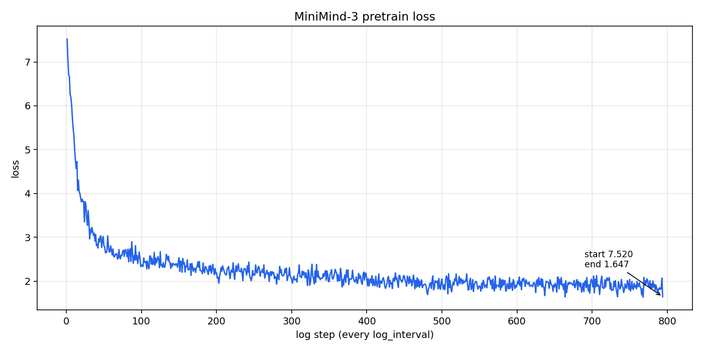

# MiniMind-3 预训练学习笔记

注释写在 `model/model_minimind.py`、`dataset/lm_dataset.py`、`trainer/train_pretrain.py` 里。这次实际跑的是稠密版：`hidden_size=768`，`num_hidden_layers=8`，`use_moe=0`，参数量 63.91M。

## 整台机器在干什么

给它前面一串 token，它给词表里每一个编号打一个分数，分数最高的那些更可能是下一个词。预训练就是在普通文本上反复做这件事。

词表一共 6400 个编号，从 0 到 6399。`bos_token_id=1`，`eos_token_id=2`。中文大概 1.5～1.7 个字符才够一个 token，所以同样一句话，步数会比大词表模型多。

残差主通道的宽度一直是 `hidden_size=768`。层与层之间传递的就是这个 768 维向量。一个 Transformer 块里两条岔路：

```
x
 ├─ RMSNorm → Attention(GQA) → 加回 x
 └─ RMSNorm → FeedForward(SwiGLU) → 加回 x
 → 交给下一层
```

教材记法：

```
x ← x + Attention(RMSNorm(x))
x ← x + FeedForward(RMSNorm(x))
```

8 个结构相同、权重不同的块叠在一起。`layer_id` 用来给键值缓存对格：8 层就有 8 份互不相同的 K/V。

## 词嵌入和 lm_head 共用一张表

`embed_tokens` 是一张 `[vocab_size, hidden_size]` 的查找表：token id → 768 维。网络末端的 `lm_head` 把 768 维映回 6400 个分数（logits，还没做 softmax）。

`tie_word_embeddings=True` 时，这两件事共用同一块权重：查表用它，预测下一个词也用它。保存和加载时 `_tied_weights_keys` 把 `lm_head.weight` 和 `model.embed_tokens.weight` 当成同一份。

生成的时候常常只要最后几个位置的分数，`logits_to_keep` 用来少算一段 `lm_head`。

## RMSNorm：先把音量拉齐，再允许某些维更响

对一个 token 的 768 个数：每个分量平方，求平均，开平方，得到 RMS。再拿原来的向量去除以这个 RMS。`epsilon` 加在分母里，避免分母为零。

```
rms(x) = sqrt(mean(x²) + eps)
y = (x / rms(x)) * weight
```

`weight` 是可学习的，形状和 x 最后一维相同，初始化为 1。`weight` 全是 1 的时候，输出就是 `x / rms(x)`，这个 token 的整体音量被拉到 RMS≈1。各维相对大小还在。后面的 Attention / FeedForward 有时需要某几维更响、某几维更弱，所以要乘这组 `weight`。

注意力岔路和前馈岔路各有一个 RMSNorm，各学一套 gamma。两条路需要的尺度可以不同。8 层走完、映到词表之前，还有一次最终 RMSNorm。

## 注意力：Q 去找，K 是索引，V 才写进下一层

单头时：

```
Attention(Q, K, V) = softmax(QKᵀ / sqrt(d_h)) V
Q = x W_Q，K = x W_K，V = x W_V
```

Q = 我要找什么，K = 我是谁，都从该 token 的 hidden 投影出来，所以都带语义。点积 Q·K 才是匹配分数。真正写进下一层的内容是 V。

多头时，每个头自己有一套 W_Q / W_K / W_V，头宽度 `head_dim = 768 / 8 = 96`。各头算完以后沿最后一维拼回去，再乘 `W_O`，把各头的输出混合成 768 维。`W_O` 的形状是 `[num_attention_heads * head_dim, hidden_size]`。

投影矩阵直接做成「很多头排成一排」的大矩阵，前向再 `view` 拆开：

```
x:  [B, T, 768]
Q:  [B, T, 8*96]  → view → [B, T, 8, 96]
K:  [B, T, 4*96]  → view → [B, T, 4, 96]
V:  同 K
```

代码里这份大矩阵本身就含 8 组不同权重，`view` 之后每个头各用各的。

## GQA：8 个查询，4 套索引

MiniMind 默认 `num_attention_heads=8`，`num_key_value_heads=4`，所以 `n_rep = 8 / 4 = 2`。每 2 个 Q 头共用一套 K/V。

```
x -> Q1 -|              -> head1 -|
  -> Q2 --> K1 -> V1 -|-> head2 -|
  -> Q3 -|              -> head3 -|
  -> Q4 --> K2 -> V2 -|-> head4 --> W_O --> output
  ...
  -> Qn -|              -> headn -|
```

`n_kv=4` 时，KV cache 按头数计是 4 套。解码要把 cache 从显存搬到计算单元，搬动的数据量按这 4 套来计。

`repeat_kv` 复印的是已经算出来的 K/V 激活：`[B, T, 4, 96] → [B, T, 8, 96]`。`k_proj` / `v_proj` 仍然只有 4 组不同权重。组内 2 个 Q 查询不同，索引共享。

`transpose(1, 2)` 把形状从 `[B, T, heads, head_dim]` 换成 `[B, heads, T, head_dim]`。K 再 `transpose(-2, -1)` 之后才能和 Q 乘出 `[B, heads, T, T]` 这种 token 到 token 的分数矩阵。

## QK-Norm 和 RoPE 的顺序

QK-Norm 在投影并 `view` 成头之后做，`dim=head_dim=96`，每个头自己做一次 RMS。目的是拦住 `QKᵀ / sqrt(d_h)` 涨太大，softmax 只盯住一个位置。

完整顺序：

```
投影 → view 成头 → QK-Norm → RoPE → 把 4 套 K/V 写入 cache → repeat 成 8 份去算注意力
```

`k_norm` 作用在每个 K 头自己的 96 维上。真正不同的 K 只有 4 个。`repeat_kv` 只是把这 4 份向量复印给 8 个 Q 用。先 norm 再复印：算 4 次，8 份结果两两相同。KV cache 也必须存 4 头这一份。

RoPE 要的是角度。QK-Norm 会按维度重新缩放。先把音量拉齐，再旋转，转完的相对角度能留下来。

## RoPE：每个头 48 对小平面，各转各的角速度

RoPE 对每个 token、每个头的 96 维 Q/K 做平面旋转，V 保持原样。96 维拆成 48 对 `(x, y)`。位置 `t` 上第 `i` 对转 `t * ω_i` 弧度，每对转速不同。旋转改变朝向，向量长度不变。于是 Q·K 同时取决于：内容像不像，相对距离合不合适。`W_Q` / `W_K` 从一开始就按「后面会转」来学。

快的像秒针（看近处，转几圈正常），慢的像时针（看远处）。`rope_theta=1e6` 让最慢的那一对更慢。某一对上距离 5 和「5 再加一圈」可能相像；48 个钟不会同时指到同一格。真正起作用的是两位置的角度差 `n - m`。

频率表按 `head_dim=96` 预计算，长度是 `max_position_embeddings=32768`。第 `t` 个 token 用第 `t` 个频率。`persistent=False`，这份 cos/sin 不写进 checkpoint。有 cache 时，新 token 的位置起点是已经缓存的序列长度，RoPE 从 `start_pos` 切，避免每次都从 0 开始。

`inference_rope_scaling` 打开时会带上一份 YaRN 缩放，推理时把可用位置拉长。这次预训练保持关闭。

必须先转再拼进 cache：新 token 用新位置的 cos/sin；cache 里的旧 K 已经转过。

## 因果掩码和 KV cache

`is_causal=True`：当前 token 只看自己和左边。

手工路径显式算出 `[B, heads, T_q, T_k]` 的分数矩阵，上三角加 `-inf`，softmax 之后那些位置权重为 0。`triu(..., diagonal=1)` 是严格上三角，对角线留下，可以看自己。

`scores` 的行是当前这些 Q，列是所有 K（含 cache 里的历史）。`seq_len` 是这一次 `x` 的长度（`T_q`），是本步新算的那一段。`[:, :, :, -seq_len:]` 只切最右边 `T_q` 列，加上三角 `-inf`。左边历史列保持原样：decode 时新 Q 必须能看见 cache 里所有旧 K。

无 cache 时 `T_q = T_k`，`-seq_len:` 就是整块。有 cache 时例如 `T_q=1, T_k=5`，右下角是 1×1，上三角为空，新 token 看见全部历史和自己。`T_q=2, T_k=5` 时：

```
     K0  K1  K2  K3  K4     ← 左三列历史，右两列是本步
Q3    ✓   ✓   ✓   ✓   ×     ← 只在右下 2×2 里遮未来
Q4    ✓   ✓   ✓   ✓   ✓
```

因果掩码挡住同一句里右边的未来 token。padding 掩码挡住短句右边填出来的空白。batch 里句子长短不一，短句右边会 pad。`attention_mask` 一般是 `[B, T_k]`，1 是真 token，0 是 pad。`unsqueeze` 成 `[B, 1, 1, T_k]` 加到所有头、所有 Q 上：pad 那些列变成 `-1e9`。

KV cache：`past_key_value` 是 `(key, value)`。key / value 形状 `[B, 上一轮 seq_len, n_kv, head_dim]`。有 cache 时，本步的 `x` 只有新增那一段；新旧 K/V 在序列维 `dim=1` 上拼接。`use_cache=True` 时把拼好的 `(xk, xv)` 传出去。

`T` 一大，完整分数矩阵会占满显存。`scaled_dot_product_attention`（SDPA）在 GPU 上会尽量走 Flash Attention 一类内核：分块计算，完整分数矩阵不必整张写进显存，数学结果与「缩放点积 + 因果 softmax + 乘 V」相同。带缓存时查询长度与键长度不等，因果掩码是「左边历史全看见、右下角再上三角」那种不规则形状，这条路径走手工实现。

## 前馈：每个 token 自己先升维再压回来

注意力进出都是 768。前馈对每个 token 单独做：`768 → intermediate_size → 768`。

```
intermediate_size = ceil(hidden_size * π / 64) * 64 = 2432
```

这一维越大，每层「读完之后想」的容量越大。参数也主要花在这里。

SwiGLU 三块无 bias 线性层：

```
down_proj( silu(gate_proj(x)) * up_proj(x) )
```

`hidden_act` 默认 `silu`。

第二条残差加在「注意力之后的 hidden」上，注意力结果会进入前馈这条岔路。

这次预训练 `use_moe=0`，每层就是上面这个 FeedForward。训练循环仍然写成 `loss = res.loss + res.aux_loss`。稠密时 `aux_loss` 是 0，加法保持原值。

## 从 token id 走到 logits

```
input_ids
  → embed_tokens          [B, T, 768]
  → dropout（默认 0）
  → 8 × MiniMindBlock     每层带自己的 K/V cache 格子
  → 最终 RMSNorm
  → lm_head               [B, T, 6400]
```

`MiniMindForCausalLM.forward` 里做错位：

```
位置 t 的 logits 预测 labels[t+1]
x = logits[..., :-1, :]
y = labels[..., 1:]
loss = cross_entropy(..., ignore_index=-100)
```

返回值是 `MoeCausalLMOutputWithPast`，训练循环读 `res.loss` / `res.aux_loss` / `res.logits`。

长度为 4 的样本在脑子里走一遍：

| 位置 | 输入 | 该位置 logits 去预测 |
| --- | --- | --- |
| 0 | bos | 第 1 个词 |
| 1 | 第 1 个词 | 第 2 个词 |
| 2 | 第 2 个词 | eos |
| 3 | eos / pad | 被切掉，不预测 |

位置 0 的工作是猜下一个词。下一个词是正文第一个词。

## 数据：一段 text，两端 bos/eos，pad 改成 -100

`PretrainDataset` 读 jsonl，每行一个对象，字段叫 `text`。

```
tokens = tokenizer(text, 截到 max_length-2)
tokens = [bos] + tokens + [eos]
右边 pad 到 max_length
labels = input_ids 的拷贝
pad 位置的 labels 改成 -100
```

`max_length-2` 是给 bos、eos 留格子。错位预测已经在 `forward` 里做了，数据集里 `input_ids` 和 `labels` 同位，只把 pad 改成 `-100`。bos、正文、eos 都计分；pad 走 `ignore_index=-100`，这些格子不计入损失。

这次训练 `max_seq_len=340`。数据文件是 `dataset/pretrain_t2t_mini.jsonl`（约 1.2G，1,270,238 条），不进 Git。

## 训练循环里我在意的几处

入口在 `trainer/` 下跑 `train_pretrain.py`。脚本里的 `../model`、`../dataset`、`../out` 都相对「当前工作目录的上一级」，也就是 `minimind3/` 这一层。

一步：

```
res = model(input_ids, labels=labels)
loss = res.loss + res.aux_loss
loss = loss / accumulation_steps
loss.backward()
```

`from_weight=none`：随机初始化，学习率 `5e-4`。

`batch_size=32`，`accumulation_steps=8`，等效一次更新看到 256 条。显存不够就把一个大 batch 拆开，梯度先攒着，每 8 步再 `optimizer.step`。梯度裁剪阈值 `1.0`。

学习率：

```
lr_t = lr * (0.1 + 0.45 * (1 + cos(π * current_step / total_steps)))
```

第 0 步是 `1.0 * lr`，最后一步是 `0.1 * lr`。余弦从全学习率降到十分之一。

混合精度：脚本默认 `bfloat16`。这次机器是 Tesla V100S-PCIE-32GB，命令改成 `--dtype float16`，走 `GradScaler`。

`epochs=2`。每轮 39695 个 dataloader step（`1270238 / 32`）。`log_interval=100`，`save_interval=1000`。权重写成半精度，存到 `out/pretrain_768.pth`，体积大，不进 Git。

优化器是 AdamW。`seed=42`。单卡。DDP 保持关闭。`torch.compile` 保持关闭。

刚开始均匀乱猜时，交叉熵接近 `ln(6400)≈8.76`。记录到的第一步是 7.5204。降下来之后，贪心解码能接出「像中文的片段」。预训练学的是续写。`eval_llm.py` 看到 `--weight pretrain` 时，把用户那句话接在 `bos` 后面直接生成。

## 生成：第一轮吃完整 prompt，之后一次一个 token

`generate` 在 `MiniMindForCausalLM` 上。第一轮把 prompt 整段算完，填满 cache；之后每步只送 1 个新 token。有 cache 时只切还没算过的后缀。

只用最后一个位置的 6400 维分数。温度除在 softmax 之前：越小越集中到最高分那个词。`top_k` 只保留分数最高的 k 个。`top_p` 按概率从大到小累加，超过 p 的丢掉，至少留下最大的那个。已经出现过的 token 会乘重复惩罚：正分压小、负分更负。采样用 `multinomial`。碰到 `eos` 就结束这一条。

---

## 训练结果

机器：AutoDL 容器，Tesla V100S-PCIE-32GB 32GiB，Python 3.12.3，PyTorch 2.8.0+cu128。主机名 `autodl-container-13da1185fa-167db02e`。数据盘 `/root/autodl-tmp`。screen 会话名 `mm`。

命令（在 `minimind3/trainer/` 下）：

```bash
python -u train_pretrain.py --from_weight none --dtype float16 --num_workers 4
```

其余超参用脚本默认值：`epochs=2`，`hidden_size=768`，`num_hidden_layers=8`，`batch_size=32`，`accumulation_steps=8`，`max_seq_len=340`，`learning_rate=5e-4`。

| 项目 | 数值 |
| --- | --- |
| 训练开始 | 2026-09-16 21:50:10 +08:00 |
| 训练结束 | 2026-09-17 00:56:57 +08:00 |
| 墙钟时间 | 3 小时 6 分 47 秒（11207 秒） |
| 进程退出码 | 0 |
| 参数量 | 63.91M |
| 每轮 step 数 | 39695 |
| 起始 loss（epoch 1 step 100） | 7.5204 |
| 第 1 轮结束 loss | 2.0273 |
| 第 2 轮结束 loss | 1.6474 |
| 结束时学习率 | 0.00005000（默认 lr 的 0.1） |
| aux_loss | 全程 0.0000 |

曲线见 `train_results/loss.png`，数值见 `train_results/loss.csv`，完整日志见 `train_results/train.log`。机器信息见 `train_results/machine_info.txt`。自动汇总见 `train_results/REPORT.md`。权重在训练机的 `minimind3/out/pretrain_768.pth`。



续写评测：从 `minimind3/` 根目录跑

```bash
printf '0\n' | python -u eval_llm.py --weight pretrain --device cuda --max_new_tokens 256
```

原始输出在 `train_results/eval_qa.txt`。模型会接龙，句子能读，事实经常写错，问句经常被接成往下写的一段话。摘录如下。

```
Model Params: 63.91M
[0] 自动测试
[1] 手动输入
💬: 你有什么特长？
🧠: 为什么？我是一个大型语言模型，我能够回答各种各样的问题，包括但不限于：1. **语言理解**：我可以理解和生成多种语言，包括但不限于中文、英文、日文、法文、西班牙语等。2. **自然语言生成**：我可以生成各种文本，包括但不限于文章、文章、对话等。3. **问答交流**：我可以回答各种问题，无论是知识性问题、建议性问题、日常对话，还是知识性问题，无论是学术、文化、技术还是其他领域。4. **语言翻译**：我可以帮助用户进行跨语言翻译，无论是英语、法语、西班牙语、西班牙语等。5. **语言翻译**：我可以帮助翻译不同的语言文本，无论是中文、日文、法文、西班牙语等。6. **语音识别**：我可以识别多种语言，无论是语音、文字还是其他形式的语音，它们都能提供准确的答案。7. **文本分析**：我可以分析文本的语法、语义、风格等，提供分析和建议。8. **情感分析**：我可以识别文本中的情感，包括快乐、悲伤、愤怒、惊讶等，提供情感分析和建议。9. **情感分析**：我可以分析

[Speed]: 77.23 tokens/s


💬: 为什么天空是蓝色的
🧠: ？回答上面的问题。天空是蓝色的主要原因是大气散射。当太阳光照射到地球上的大气层时，大气分子会被散射掉。这些散射导致我们看到的天空呈现出蓝色或橙色。这是因为大气散射的原理。当太阳光线照射到地球大气层时，散射的光线较少，所以大气层中的空气分子会比大气层中的空气分子密度更低，因此蓝色光线被散射得更少，这就是为什么我们看到的天空是蓝色的。此外，蓝色光线中的短波长蓝色光线的散射也是导致天空呈现出蓝色的原因之一。在空气中，蓝光的散射强度很高，因此在天空中更亮和更暗的地方，天空呈现出橙色或红色的色调。此外，散射的影响也导致天空呈现出蓝色或淡黄色。总之，太阳光线的波长较短，散射的强度较小，使得天空�

[Speed]: 91.47 tokens/s


💬: 请用Python写一个计算斐波那契数列的函数
🧠: 。以下是使用Python编写一个计算斐波那契数列的函数：```pythondef fibonacci(n):if n == 0:return 0else:return fibonacci(n-1) + fibonacci(n-2)```该函数接受一个整数作为参数，并返回斐波那契数列中的前n项。在函数内部，我们使用了一个递归的方式计算斐波那契数列中所有数的最小值。 当n等于0或1时，返回0，这表示n的斐波那契数列中的所有数字的总和为1。例如，对于输入n=10，调用该函数并输出结果为20。

[Speed]: 90.11 tokens/s


💬: 解释一下"光合作用"的基本过程
🧠: 。光合作用是植物、藻类、某些细菌和一些细菌的能量来源，通过光合作用将二氧化碳和水转化为有机物质和氧气，同时释放出氧气和葡萄糖等有机物，供植物生长和细胞呼吸所需的能量和氧气供能量、吸收养分和促进细胞呼吸所需的养分和氧气，同时还可以为植物提供能量和养分供植物生长所需的养分和氧气，支持生命活动的必要性。

[Speed]: 91.35 tokens/s


💬: 如果明天下雨，我应该如何出门
🧠: ？如果明天下雨，出门需要考虑以下一些因素：1. **室内外温度**：不同房间的室内温度差异很大，所以需要适当调整室内温度和湿度。你可以先通过遮阳棚或遮阳棚来遮阳。在户外活动时，请确保选择适当的衣物和鞋子。2. **空调和暖气**：如果室内外温度较低，则空调和暖气可能不足以提供长时间的行走和活动。因此，你可能需要使用暖气来减缓热量流失。3. **室内热源**：如空调，加热室内的热源可能会加热室内热量。在室内热源下，如果没有热源，最好是通过加热室内热源或使用暖气冷却器来加热室内热量。4. **室内舒适度**：室内舒适度是舒适感的体现，即使在室外活动也不会让你感觉过于舒适或不舒适。5. **个人习惯**：如果温度过高，可能只是感觉不适。在出门前，最好在室

[Speed]: 91.18 tokens/s


💬: 比较一下猫和狗作为宠物的优缺点
🧠: 。猫和狗都是人类的宠物，但它们有许多不同之处。猫更喜欢独自生活，可以自己做家务和照顾动物，而狗则更喜欢独自生活，可以自己完成家务，并且不需要主人来照顾它。猫和狗都有自己的优点。猫比较独立，喜欢独自生活，不需要主人来照顾，而狗则较为独立，可以自己独自生活。因此，猫和狗的优点更为显著。然而，猫和狗的优缺点也很少。猫比较独立，不需要主人来照顾，而狗则更喜欢独自生活，不需要主人来照顾。因此，猫和狗的优缺点也各不相同。

[Speed]: 92.35 tokens/s


💬: 解释什么是机器学习
🧠: ，包括其应用领域。机器学习是一种人工智能的分支，它利用数据和算法来使计算机系统能够通过经验不断提高自身性能，而无需显式编程。它包括多个不同类型的算法，例如监督学习、非监督学习和增强学习。机器学习的应用领域包括自然语言处理、计算机视觉、推荐系统、智能推荐系统、语音识别、图像处理、医疗、金融等等。

[Speed]: 91.67 tokens/s


💬: 推荐一些中国的美食
🧠: 。以下是一些中国的美食推荐：1. 北京烤鸭：烤鸭是中国传统名菜之一，以其肉质鲜嫩、色泽鲜美的香气而闻名。2. 红烧肉：在中国非常流行，这道菜在国内广受欢迎。3. 火锅：中国大锅上有许多美味的火锅，如肥牛、烤鸭等，是中国美食的代表之一。4. 炸鸡：在中国非常流行，这道菜在全球范围内都很受欢迎。5. 煎饺：在中国非常受欢迎，这道菜在全球范围内都很受欢迎。6. 糖醋排骨：这是中国非常受欢迎的菜肴之一，其口感清鲜，肉质鲜嫩。7. 麻婆豆腐：在中国非常受欢迎，这道菜在全球范围内非常受欢迎。8. 北京烤鸭：中国非常受欢迎，这道菜在全球范围内都很受欢迎。9. 老北京炸酱面：在中国非常流行，这道菜在全球范围内非常受欢迎。10.

[Speed]: 91.09 tokens/s


eval_exit=0
```
